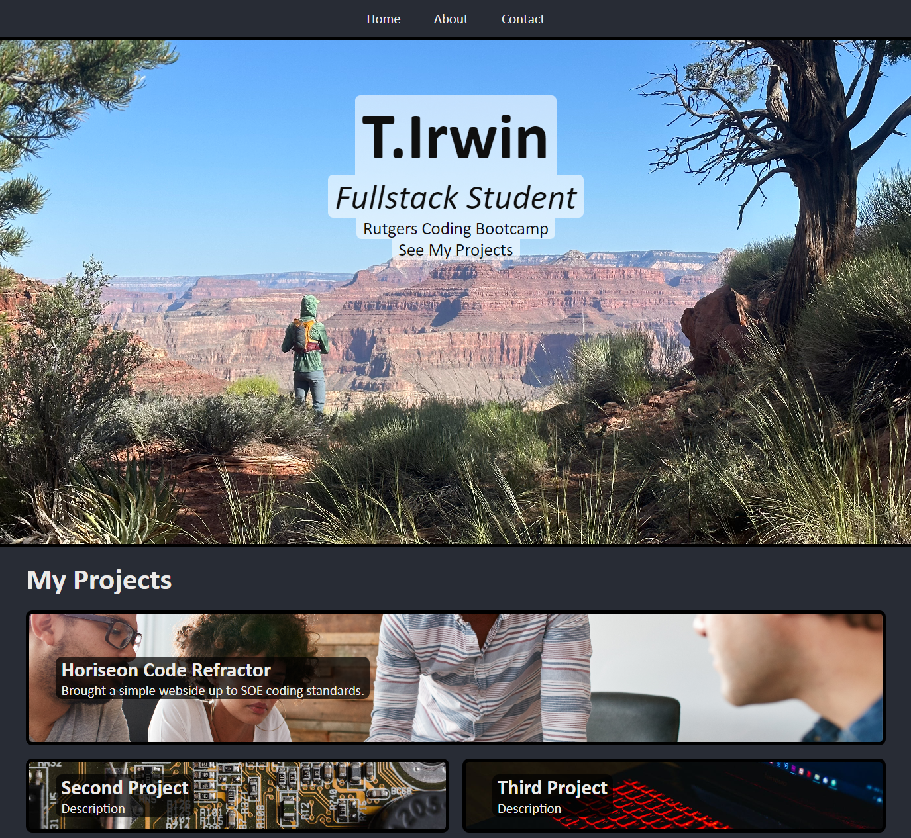
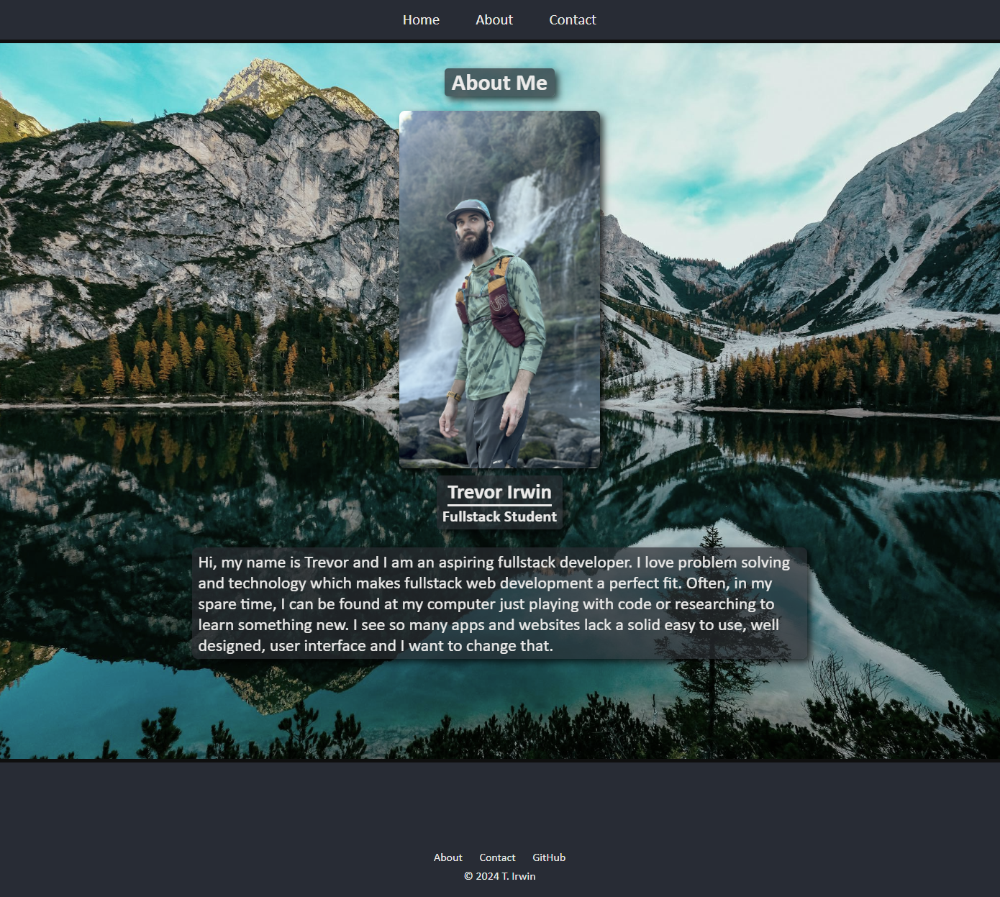
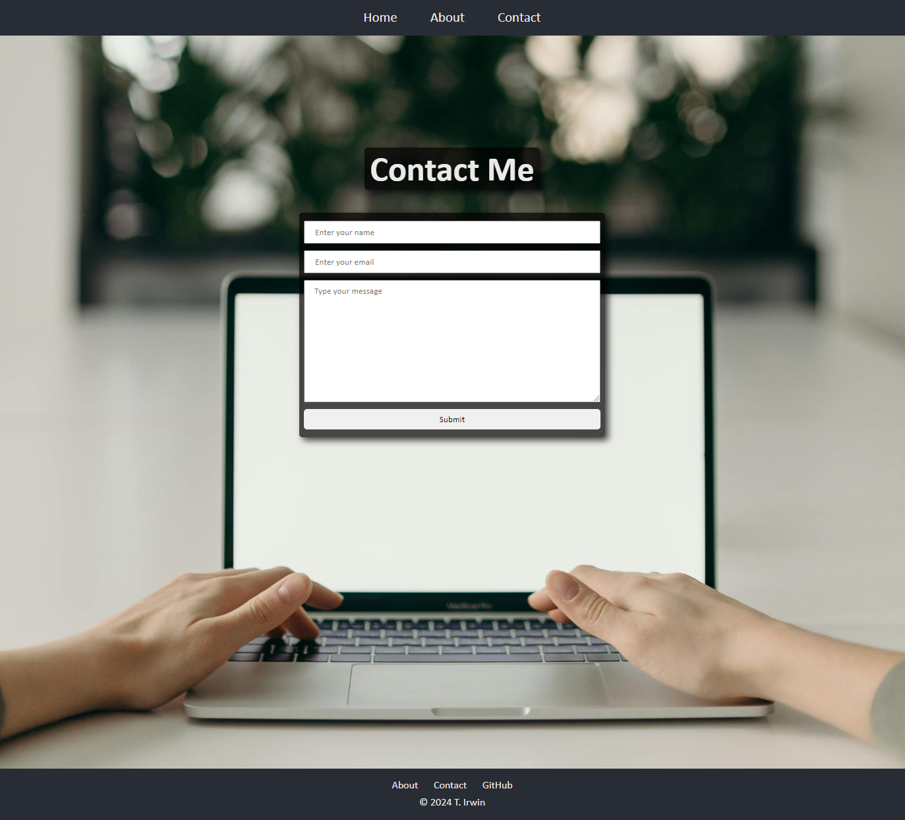

 # T. Irwin Portfolio

## Description

This webpage is a personal portfolio I made for myself for the Rutgers coding bootcamp.
The assignment entailed creating and deploying a website using HTML and CSS to meet a list of criteria. It took about 4 days to fully complete for a novice like myself but I learned many things while working on this project. I hope to improve apon it as I grow and learn as a developer. One of the style elements that took me forever to understand was the Flexbox property and how it affects its element and its children. It is used many times thruout the project and modified using things like justify-content, flex-direction, and align-items. All in all this project was only a step thru the door of web design and I'm loving it.

## Visuals

## Deployment

Provided as a link here - https://tirwin19.github.io/TIrwin_Portfolio/

## Usage

To use the webpage, you can navigate to each section by clicking on the header links at the top of the page. There are also multiple clickable links that take you to a deployed project or my Github. You can even send a message with the form on the Contact page. Try it out! To inspect each element, you can open the Chrome DevTools by pressing Command+Option+I (macOS) or Control+Shift+I (Windows). A console panel should open either below or to the side of the webpage in the browser. There you can navigate to the Accessibility tab to highlight each picture element. There are also Media Queries in use to adapt the webpage to smaller screens, tablets, and mobile devices. Try on some of your own devices to test it out.

## Credits

JD Tadlock - My Instructor for the Rutgers University Coding Bootcamp for all the help.

## License

Please refer to the LICENSE in the repo.
